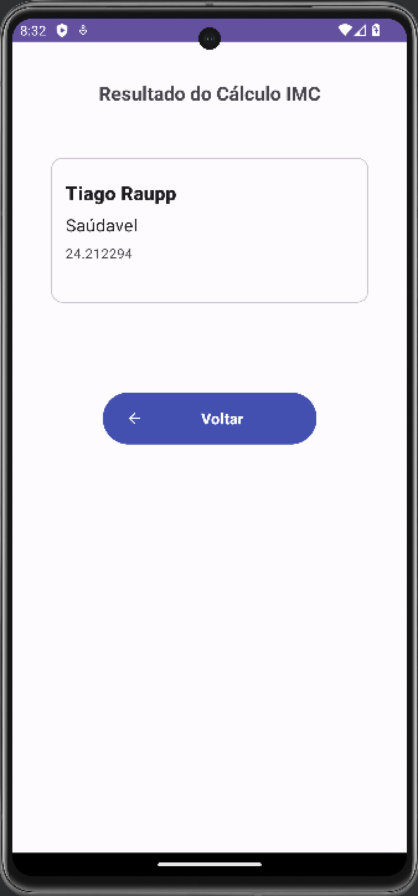

<h1 align="center"> Calculadora de IMC </h1>

Uma simples calculadora de IMC (Índice de Massa Corporal) desenvolvida em [Kotlin/Android].  

<a href="#-descricao">Descrição</a>&nbsp;&nbsp;&nbsp;|&nbsp;&nbsp;&nbsp;
<a href="#-funcionalidades">Funcionalidades</a>&nbsp;&nbsp;&nbsp;|&nbsp;&nbsp;&nbsp;
<a href="#-capturasdetela">Capturas de Tela</a>&nbsp;&nbsp;&nbsp;|&nbsp;&nbsp;&nbsp;
<a href="#-comoexecutar">Como Executar</a>&nbsp;&nbsp;&nbsp;|&nbsp;&nbsp;&nbsp;
  <a href="#-requisitos">Requisitos</a>&nbsp;&nbsp;&nbsp;|&nbsp;&nbsp;&nbsp;
  <a 
  href="#-contribuicao">Contribuição</a>&nbsp;&nbsp;&nbsp;|&nbsp;&nbsp;&nbsp;
  <a href="#-tecnologias">Tecnologias</a>&nbsp;&nbsp;&nbsp;|&nbsp;&nbsp;&nbsp;
    <a href="#-autor">Autor</a>&nbsp;&nbsp;&nbsp;|&nbsp;&nbsp;&nbsp;
   <a
href="#memo-licença">Licença</a>

  

 

## Descrição

Este projeto é uma calculadora de IMC que permite aos usuários calcular seu índice de massa corporal com base no peso e na altura inseridos.

## Funcionalidades

- Insira o peso (em kg) e a altura (em centímetros) para calcular o IMC.
- Veja a interpretação do IMC com base nas categorias estabelecidas.

## Capturas de Tela

## Como Executar

Para executar a calculadora de IMC, siga estas etapas:

1. Clone este repositório para o seu ambiente local

2. Abra o Android Studio.

3. No Android Studio, selecione "File" > "Open" e navegue até a pasta do projeto que você clonou.

4. Aguarde o Android Studio sincronizar o projeto e indexar os arquivos.

5. Conecte um dispositivo Android ou inicie um emulador.

6. Clique no botão "Run" (ícone de seta verde) na parte superior do Android Studio.

7. Escolha o dispositivo ou emulador em que você deseja executar o aplicativo e clique em "OK".

8. O aplicativo será compilado e instalado no dispositivo/emulador. Você verá a tela da calculadora de IMC.

9. Insira seu peso e altura nos campos apropriados e clique no botão "Calcular IMC".

10. O resultado do seu índice de massa corporal será exibido na tela.

## Requisitos

- Android Studio instalado.
- Dispositivo Android físico ou emulador.

## Contribuição

Contribuições são bem-vindas! Se você quiser contribuir com melhorias, correções de bugs ou novos recursos, siga estas etapas:

1. Faça um fork deste repositório.
2. Crie um novo branch para suas alterações: `git checkout -b feature/nome-da-sua-feature`.
3. Faça suas alterações e comite: `git commit -m 'Adiciona nova feature'`.
4. Envie para o seu fork: `git push origin feature/nome-da-sua-feature`.
5. Crie um pull request neste repositório.

## Tecnologias

Esse projeto foi desenvolvido com as seguintes tecnologias:

- Kotlin/Android
- Git e Github

## Autor

<a href="https://www.github.com/tiraupp">
 
  
 <b>Tiago Raupp</b></a> <a href="https://www.github.com/tiraupp" title="Cubos Academy">✨</a>
  

---

## Licença

<!-- Este projeto esta sobe a licença [MIT](./LICENSE). -->

Feito com ❤️ por Tiago Raupp 👋🏽 [Entre em contato!](https://www.linkedin.com/in/tiago-raupp/)
